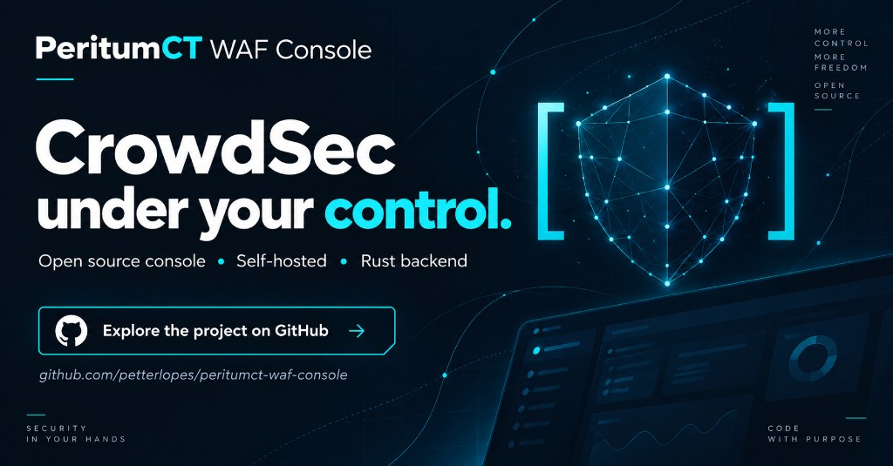
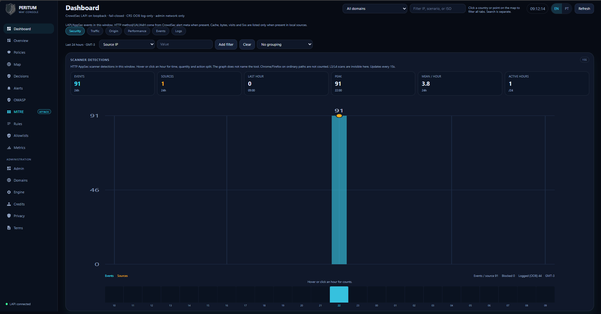
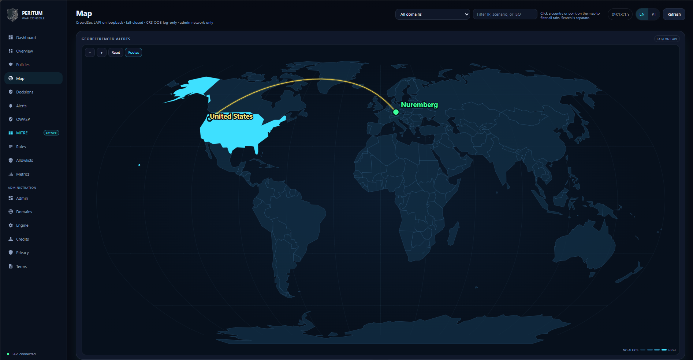
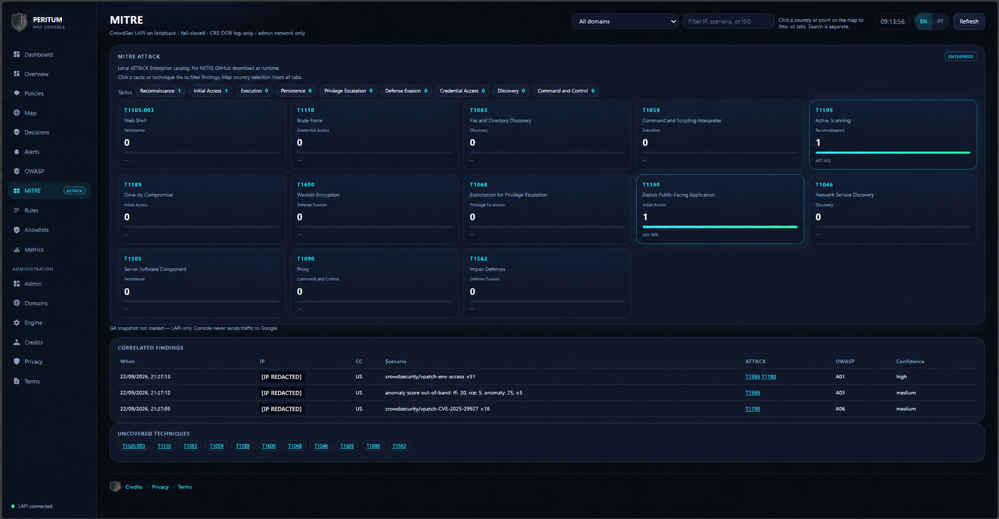
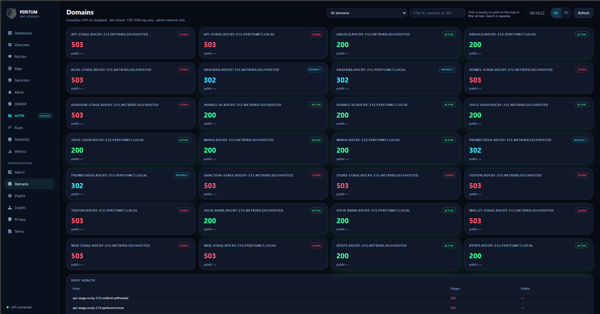
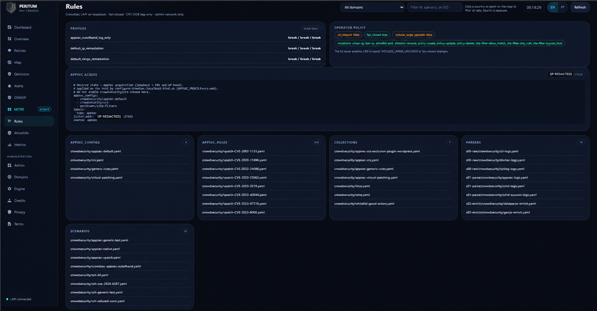

<p align="center">
  
</p>

# PeritumCT WAF Console

**An open source, self-hosted console that brings WAF operations, decisions, per-domain policies, and MITRE ATT&CK and OWASP context to the operator’s own infrastructure.**

Operations interface for **local** [CrowdSec](https://github.com/crowdsecurity/crowdsec) installations — Rust backend, static UI served by the app. It is **not** the CrowdSec cloud console.

**Default language: English.** Brazilian Portuguese (`pt-BR`) is available in the UI header.

[](LICENSE)
[](docs/TOOLCHAIN.md)
[](https://github.com/crowdsecurity/crowdsec/releases/tag/v1.8.1)

| | |
|--|--|
| **Console** | **2.0.4** · GPL-3.0-or-later · [NOTICE](NOTICE) |
| **Engine** | CrowdSec **v1.8.1** (MIT, separate process) |
| **Article** | [Local control of CrowdSec, powered by a Rust backend](https://periciacomputacional.com/peritumct-waf-console-local-control-of-crowdsec-powered-by-a-rust-backend) |
| **Docs** | [PRODUCT](docs/PRODUCT.md) · [INTEGRATION](docs/INTEGRATION.md) · [HOMOLOGATION](docs/HOMOLOGATION.md) · [MARKETING](docs/MARKETING.md) |
| **pt-BR** | [README.pt-BR.md](README.pt-BR.md) |

```
Contribute: issues & PRs welcome · Explore · Test · Contribute →
github.com/petterlopes/peritumct-waf-console
```

## Why it exists

Installing a protection engine is only part of the work. Operators need to know which domain is failing, why an IP was blocked, which rules exist, and when an exception is justified — without moving the admin UI to an external SaaS.

PeritumCT WAF Console keeps that workflow **next to the engine**: LAPI alerts and decisions, per-FQDN AppSec policies, allowlists, Domains probes, metrics, a LAPI-based map, and local OWASP Top 10:2021 / MITRE ATT&CK correlation. CrowdSec detects; remediation components protect traffic; this console **operates and explains**.

## Screenshots

<p align="center">
  
</p>

<p align="center">
  
  &nbsp;
  
</p>

<p align="center">
  
  &nbsp;
  
</p>

More captures and captions: [docs/media/README.md](docs/media/README.md).

## Capabilities

- **Dashboard / Overview** — security action items, detection tools, 24h LAPI traffic (honest sample metadata when capped)
- **Policies** — per-FQDN AppSec: allow path, skip named in-band rule, host bypass (with confirmation)
- **Decisions & Allowlists** — local ban/unban (≤168h); CIDR allowlist via `cscli` / Nomad exec
- **Alerts · Map · Metrics · Domains** — LAPI geo map (no third-party GeoIP API); HTTPS probes with status palette
- **OWASP · MITRE** — local catalogs only (no runtime download from MITRE/OWASP GitHub)
- **CTI exports** — downloadable STIX / MISP / TheHive-shaped files; **no** automatic outbound push
- **Hardening** — loopback bind only; SSRF checks; rate limits; CSP; `/waf` must stay **off** the bouncer

## Homologated platforms

| Platform | Status |
|----------|--------|
| **Docker Compose** | Homologated (admin: `pid: host` + `user: "0:0"`) |
| **Podman Compose** | Homologated |
| **Kubernetes** (Traefik CRDs) | Homologated |
| **Cilium** (CNI / LB → Traefik) | Homologated |

Matrix: [docs/HOMOLOGATION.md](docs/HOMOLOGATION.md)

## Quick start

```bash
cp examples/sites.json /var/lib/waf-control/sites.json   # edit FQDNs
cp docker-compose.example.yml docker-compose.yml         # host CrowdSec mounts + cscli
docker compose up -d --build
curl -sf http://127.0.0.1:18990/api/health
# UI: http://127.0.0.1:18990/waf/
```

Policy apply and allowlists need the **admin** Compose shape (see example comments). Read-only replicas can drop `pid: host` / root.

## What it never does

- Enable CRS in-band, bot challenge, `INCLUDE_LARGE_UPLOADS`, or flip fail-closed off
- Put `/waf` behind the CrowdSec bouncer (anti-lockout)
- Replace CrowdSec detection / Traefik remediation
- Claim “first in the world” exclusivity — differentiate by the **local + Rust + per-FQDN + OWASP/MITRE** combination

## Operator honesty (2.0.4+)

| Topic | Reality |
|-------|---------|
| **Fail-closed** | Console reports CSO-enforced metadata (`fail_closed_mode=cso_enforced`). Validate on the **bouncer**. |
| **24h dashboard** | LAPI `since=24h` + client filter; if fetch hits `WAF_ALERTS_LIMIT`, UI discloses `sample.capped`. |
| **AuthN** | No built-in login — protect with NetBird / Teleport / IdP admin middleware. |
| **Policies** | Need writable AppSec mounts + SIGHUP privilege. |

## Documentation

| Doc | Topic |
|-----|--------|
| [docs/PRODUCT.md](docs/PRODUCT.md) | Positioning & boundaries |
| [docs/ARCHITECTURE.md](docs/ARCHITECTURE.md) | Modules |
| [docs/INTEGRATION.md](docs/INTEGRATION.md) | Deploy next to CrowdSec |
| [docs/HOMOLOGATION.md](docs/HOMOLOGATION.md) | Docker / Podman / K8s / Cilium |
| [docs/TOOLCHAIN.md](docs/TOOLCHAIN.md) | Rust 1.98.1 |
| [docs/MARKETING.md](docs/MARKETING.md) | GitHub About, LinkedIn, social assets |
| [docs/SECURITY.md](docs/SECURITY.md) | CI / SAST |
| [CHANGELOG.md](CHANGELOG.md) | Releases |

## Security scans

```bash
cd rust
cargo test --test unit_smoke --test parity_smoke
cargo clippy --all-targets -- -W clippy::correctness
```

CI: Rust tests, Trivy (**v0.74.0**), secret scan — [docs/SECURITY.md](docs/SECURITY.md).

## Privacy & legal

Audit events stay local (`WAF_CONTROL/audit.jsonl`). No third-party analytics in the UI.

- [docs/CREDITS.md](docs/CREDITS.md) · [docs/PRIVACY.md](docs/PRIVACY.md) · [docs/TERMS.md](docs/TERMS.md)
- UI: Credits · Privacy · Terms

## Contributing

See [CONTRIBUTING.md](CONTRIBUTING.md) and [SECURITY.md](SECURITY.md).  
Explore, test in a lab, open issues and PRs — help make local CrowdSec operations easier to understand and verify.
